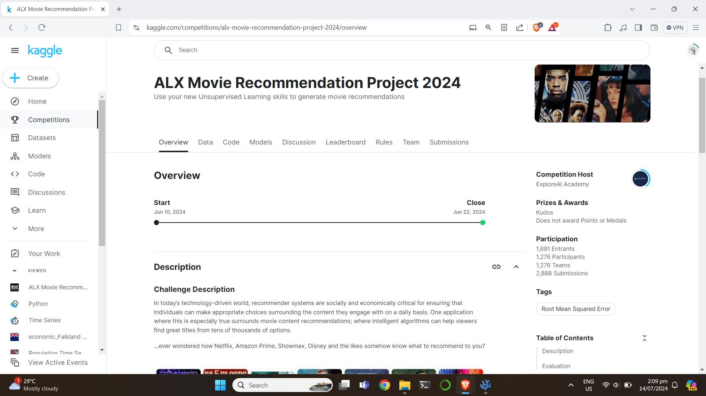
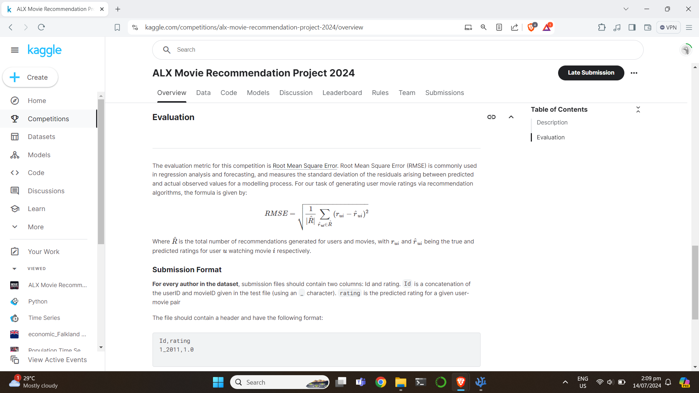
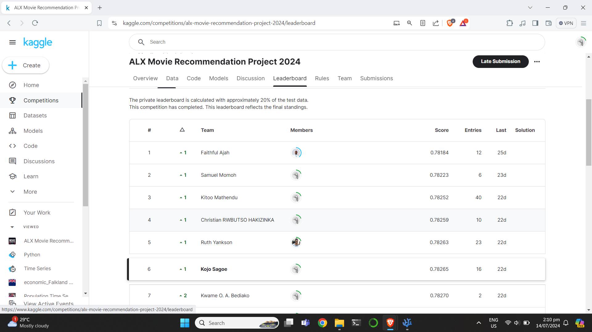
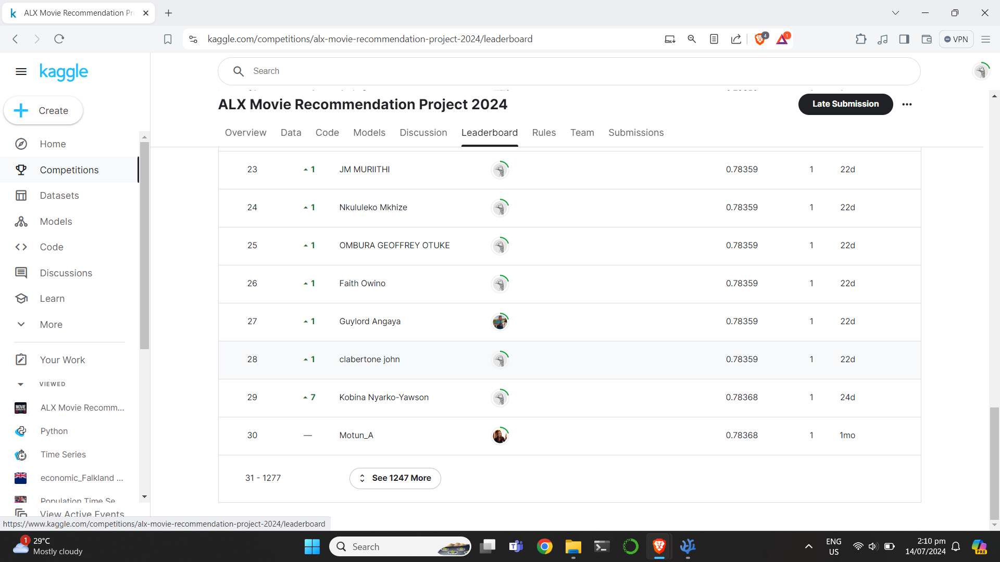

# Movie Recommendation-Engine
This project aims at creating a recommender system for movie ratings using the collaborative method. The project was inspired by ExploreAI Academy under their Data Science program. 

<b>ALX Movie Recommendation Project 2024</b>
Link: https://www.kaggle.com/competitions/alx-movie-recommendation-project-2024/overview

## Project Highlights:
- Created predictions for 5000019 users and movies indicated by (userId_movieId, rating). Using the the RMSE as the value for model evaluation the hyperparameters {'n_epochs':40, 'n_factors':1800, 'init_std_dev':0.005, 'random_state':42} gave a score of `0.820502`

## Data Sources:
- Source: 
    IMDB Movie (train) https://drive.google.com/file/d/1kXRv1cyi-bshxXcqRzrTxhAo_ri4kCrX/view?usp=sharing
    IMDB Movie (test) https://drive.google.com/file/d/1iPLdKH8YbVJAsar6a4XSDy2-e8G7m62q/view?usp=sharing

## Tools and Technologies:
Programming Language(s): Python

Libraries: suprise https://surpriselib.com/, pandas, numpy, seaborn, matplotlib

## Getting Started:
1. Clone this repository: `git clone https://github.com/02sagoe/Movie-Recommendation-Engine.git`
2. Install dependencies: `pip install -r requirements.txt`
3. Use this notebook: `python main.ipynb`